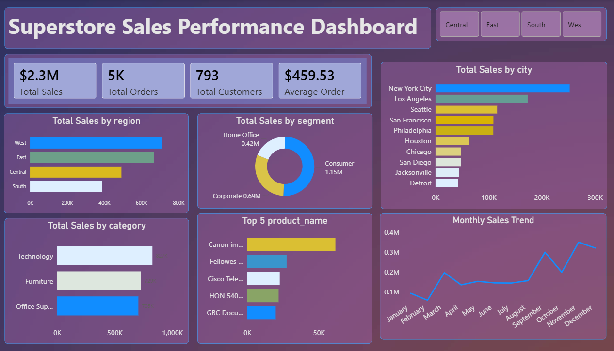

# Superstore Sales Analysis

## Project Overview
This project analyzes sales data from the Superstore dataset to evaluate overall business performance, customer behavior, and regional sales trends.
The goal is to generate business insights using Excel, PostgreSQL, and Power BI.

## Dataset
- **Source:** Kaggle
- **Name:** Superstore Sales Dataset
- **Format:** CSV

**Data:**
- [Dataset csv](data/superstore.csv)
---
## Data Cleaning (Excel)
- Removed blank rows
- Removed duplicate order ID
- Standardized column names (lowercase, underscores)
- Converted date columns to proper date format
- Ensured sales values were numeric

**Cleaned File:**  
- [Superstore_cleaned.xlsx](excel/superstore_cleaned.xlsx)
---
## Key SQL Analysis
- Total sales calculation
- Monthly sales trend analysis
- Average sales per customers
- Data quality check (Duplicates)
- Sales by category
- Top 10 customers by sales
- Identify repeat customers
- Product and Category analysis

 **SQL Queries:**  
[View SQL Analysis](sql/superstore_queries.sql)

---

## Power BI Dashboard
An interactive Power BI dashboard was created to visualize key business metrics and insights.

**Power BI File:**  
- [Download Power BI Dashboard](powerbi/superstore_sales_performance_dashboard.pbix)

## Power BI Dashboard Features
- KPI Cards (Total Sales, Total Orders, Total Customers, Average Order Value)
- Monthly sales trend (line chart)
- Sales by category (bar chart)
- Sales by region (bar chart)
- Sales by segment (bar chart)
- Sales by city (bar chart)
- Top 5 products visualization
- Slicers for Region


---

##  Dashboard Screenshot


---


## Key Insights
- The Superstore generated approximately $2.3M in total sales from nearly 5,000 orders.
- The West region is the highest-performing region, while the South region has the lowest sales.
- Sales are heavily concentrated in major cities, with New York City leading overall sales.
- Technology category contributes the highest revenue
- A small number of top products generate major sales
- Sales show strong growth during year-end months

---

## Tools Used
- Excel (Data cleaning, Pivot Tables)
- PostgreSQL (Data analysis using SQL)
- Power BI (Interactive dashboard)

---
## Conclusion
The Superstore Sales Performance Dashboard provides a comprehensive view of business performance across regions, customer segments, products, and time periods. This project highlights how structured data cleaning, SQL analysis, and effective data visualization can uncover actionable insights and support informed business decisions. It also demonstrates practical data analyst skills applicable to real-world business scenarios.

---
## Project Structure
```
Superstore_Sales_Analysis/
│
├── data
│   └── superstore.csv
│
├── excel
│   └── superstore_cleaned.xlsx
│
├── sql
│   └── superstore_queries.sql
│
├── powerbi
│   └── superstore_sales_performance_dashboard.pbix
│
├── screenshots
│   └── dashboard_overview.png
│
└── README.md
```
